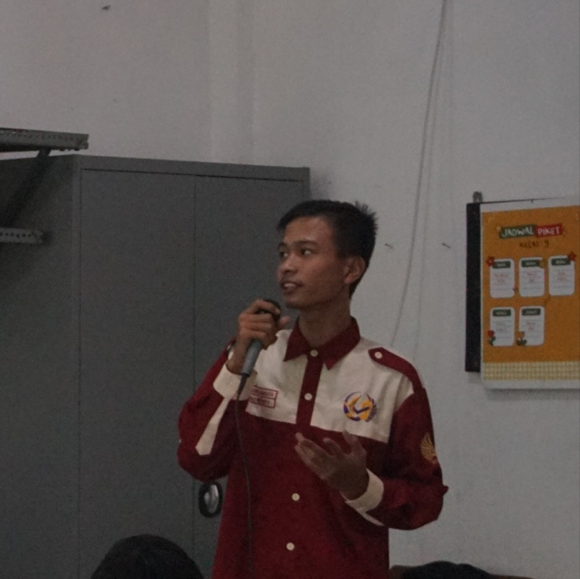
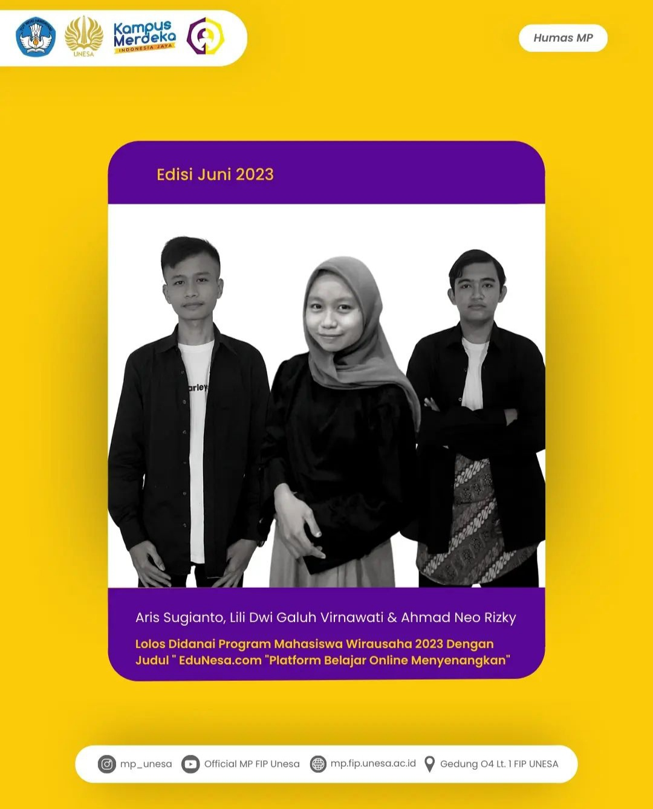
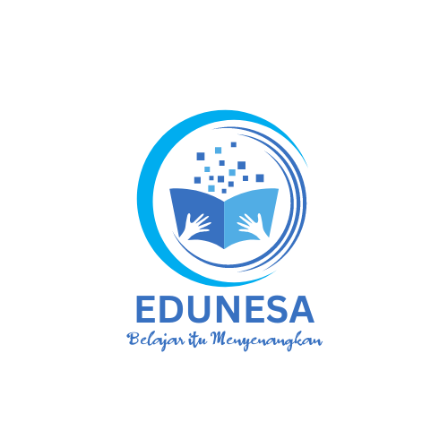

<!doctype html>
<html lang="en">

<head>
    <meta charset="utf-8">
    <meta name="viewport" content="width=device-width, initial-scale=1">
    <title>My Portofolio | Ahmad</title>
    <link href="https://cdn.jsdelivr.net/npm/bootstrap@5.3.1/dist/css/bootstrap.min.css" rel="stylesheet"
        integrity="sha384-4bw+/aepP/YC94hEpVNVgiZdgIC5+VKNBQNGCHeKRQN+PtmoHDEXuppvnDJzQIu9" crossorigin="anonymous">
</head>

<body>
    <!-- Navbar Start -->
    <nav class="navbar navbar-expand navbar-primary bg-primary" aria-label="Second navbar example">
        

            <a class="navbar-brand text-light" href="#">Ahmad Neo Rizky</a>
            <button class="navbar-toggler" type="button" data-bs-toggle="collapse" data-bs-target="#navbarsExample02"
                aria-controls="navbarsExample02" aria-expanded="false" aria-label="Toggle navigation">
                
            </button>

            

                

                    <a class="nav-link text-light" aria-current="page" href="#home">Home</a>
                    <a class="nav-link text-light" href="#about">About Me</a>
                    <a class="nav-link text-light" href="#project">Project</a>
                    <a class="nav-link text-light" href="#contact">Contact</a>
                

            

        

    </nav>
    <!-- Navbar End -->

    <!-- Home Start -->
    <section class="text-center" id="home">
        

            

                
                <h1>Ahmad Neo Rizky</h1>
                
Student | Web Developer

            

        

    </section>
    <!-- Home End -->

    <!-- About Strat -->
    <section class="about" id="about">
        

            

                

                    <h2>About Me</h2>
                

            

            

                

                    

                        
Hello, my name is Ahmad Neo Rizky. I'm from Jombang. My hobby is
                            playing music and also exploring things, including information technology. Apart from my
                            hobbies, I also have other things that I like, namely entrepreneurship and also
                            participating in esports tournaments. Besides that, I also like to design and edit both
                            photos and videos. I am an undergraduate student at Surabaya State University. My
                            organizational experiences include IPNU IPPNU, OSIS MA Al-Asy'ari Keras, and also HMP MP
                            UNESA. Apart from being a student, I also have work besides my busy life as a student.
                            Namely, I work at a tutoring institution called ESC (Excellent Study Club) as an admin and
                            branch coordinator in the village of Lidah Wetan (Surabaya). Apart from working at a
                            tutoring agency, I also have a side job or what is commonly called a freelance, namely
                            Cryptocurrency.
                        

                    

                

            

        

    </section>
    <!-- About End -->

    <!-- Project Start -->
    <section class="project" id="project">
        

            

                

                    <h2>Project</h2>
                

            

            

                

                    

                        
                        

                            <h5 class="card-title">Entrepreneurial Student Program</h5>
                            
Passed funding in the Entrepreneurial Student Program at Surabaya
                                State
                                University

                        

                    

                

                

                    

                        
                        

                            <h5 class="card-title">EduNesa</h5>
                            
EduNesa is a learning platform that provides online and offline
                                learning services with professional tutors from Surabaya State University

                        

                    

                

            

        

        

    </section>
    <!-- Project End -->

    

        <svg xmlns="http://www.w3.org/2000/svg" viewBox="0 0 1440 320">
            <path fill="#279EFF" fill-opacity="1"
                d="M0,288L48,272C96,256,192,224,288,197.3C384,171,480,149,576,165.3C672,181,768,235,864,250.7C960,267,1056,245,1152,250.7C1248,256,1344,288,1392,304L1440,320L1440,320L1392,320C1344,320,1248,320,1152,320C1056,320,960,320,864,320C768,320,672,320,576,320C480,320,384,320,288,320C192,320,96,320,48,320L0,320Z">
            </path>
        </svg>
    

    <!-- Contact Start -->
    <section class="contact" id="contact">
        

            

                

                    <h2>Contact</h2>
                

            

            

                

                    
Phone Number: +6281216800840.

                

                

                    
Email: ahmadneor1@gmail.com

                

                

                    
Instagram: @neorizky_

                

                

                    
Twitter: @ahmad68033

                

                

                    
LinkedIn: https://www.linkedin.com/in/ahmad-neo-r-4303b7281

                

                

                    
GitHup: https://github.com/ahmadneor1

                

            

        

    </section>
    <!-- Contact End -->

</body>
<footer>
    
</footer>

</html>
